# Statistics overview

This guide summarizes the core ideas from the statistics overview resource: descriptive statistics, common probability distributions, and how to choose a statistical test.

The statistical testing section below is adapted from the source repo's Jekyll templates and keeps the same high-level guidance: use the quick guide first, then refer to the complete table for edge cases and more specific scenarios.

## 1. Common descriptive statistics

Descriptive statistics summarize and describe the main features of a dataset. They are divided into three main categories based on what aspect of the data they measure.

### 1.1. Measures of central tendency, spread, and shape

<table>
	<thead>
		<tr>
			<th><strong>Category</strong></th>
			<th><strong>Statistic</strong></th>
			<th><strong>Description</strong></th>
			<th><strong>Formula / Calculation</strong></th>
			<th><strong>When to use</strong></th>
			<th><strong>Python implementation</strong></th>
		</tr>
	</thead>
	<tbody>
		<tr>
			<td rowspan="4"><strong>Central tendency</strong></td>
			<td><strong>Mean (μ or x̄)</strong></td>
			<td>Average of all values; sum divided by count</td>
			<td>μ = Σx / n</td>
			<td>Symmetric distributions without outliers</td>
			<td><code>np.mean(data)</code> or <code>data.mean()</code></td>
		</tr>
		<tr>
			<td><strong>Median</strong></td>
			<td>Middle value when data is ordered; 50th percentile</td>
			<td>Middle value or average of two middle values</td>
			<td>Skewed distributions or data with outliers</td>
			<td><code>np.median(data)</code> or <code>data.median()</code></td>
		</tr>
		<tr>
			<td><strong>Mode</strong></td>
			<td>Most frequently occurring value(s)</td>
			<td>Value with highest frequency</td>
			<td>Categorical data or multimodal distributions</td>
			<td><code>statistics.mode(data)</code> or <code>data.mode()</code></td>
		</tr>
		<tr>
			<td><strong>Trimmed mean</strong></td>
			<td>Mean after removing extreme values (for example top/bottom 5%)</td>
			<td>Mean of remaining values after trimming</td>
			<td>Data with outliers but want mean-like measure</td>
			<td><code>scipy.stats.trim_mean(data, 0.05)</code></td>
		</tr>
		<tr>
			<td rowspan="6"><strong>Spread</strong></td>
			<td><strong>Range</strong></td>
			<td>Difference between maximum and minimum values</td>
			<td>Range = max - min</td>
			<td>Quick measure of spread; sensitive to outliers</td>
			<td><code>np.ptp(data)</code> or <code>max(data) - min(data)</code></td>
		</tr>
		<tr>
			<td><strong>Variance (σ² or s²)</strong></td>
			<td>Average squared deviation from the mean</td>
			<td>σ² = Σ(x - μ)² / n</td>
			<td>Understanding variability; basis for other stats</td>
			<td><code>np.var(data)</code> or <code>data.var()</code></td>
		</tr>
		<tr>
			<td><strong>Standard deviation (σ or s)</strong></td>
			<td>Square root of variance; typical distance from mean</td>
			<td>σ = √(Σ(x - μ)² / n)</td>
			<td>Most common spread measure; same units as data</td>
			<td><code>np.std(data)</code> or <code>data.std()</code></td>
		</tr>
		<tr>
			<td><strong>Interquartile range (IQR)</strong></td>
			<td>Difference between 75th and 25th percentiles</td>
			<td>IQR = Q3 - Q1</td>
			<td>Robust to outliers; used in boxplots</td>
			<td><code>scipy.stats.iqr(data)</code> or <code>data.quantile(0.75) - data.quantile(0.25)</code></td>
		</tr>
		<tr>
			<td><strong>Mean absolute deviation (MAD)</strong></td>
			<td>Average absolute deviation from the mean</td>
			<td>MAD = Σ|x - μ| / n</td>
			<td>Less sensitive to outliers than variance</td>
			<td><code>np.mean(np.abs(data - np.mean(data)))</code></td>
		</tr>
		<tr>
			<td><strong>Coefficient of variation (CV)</strong></td>
			<td>Relative standard deviation (standardized measure)</td>
			<td>CV = (σ / μ) × 100%</td>
			<td>Comparing variability across different scales</td>
			<td><code>(np.std(data) / np.mean(data)) * 100</code></td>
		</tr>
		<tr>
			<td rowspan="2"><strong>Shape</strong></td>
			<td><strong>Skewness</strong></td>
			<td>Measure of asymmetry in the distribution</td>
			<td>Positive: right tail; Negative: left tail; 0: symmetric</td>
			<td>Assessing distribution symmetry</td>
			<td><code>scipy.stats.skew(data)</code> or <code>data.skew()</code></td>
		</tr>
		<tr>
			<td><strong>Kurtosis</strong></td>
			<td>Measure of tailedness (outlier propensity)</td>
			<td>Positive: heavy tails; Negative: light tails; 0: normal</td>
			<td>Identifying presence of outliers</td>
			<td><code>scipy.stats.kurtosis(data)</code> or <code>data.kurtosis()</code></td>
		</tr>
	</tbody>
</table>

### 1.2. Interpretation guidelines

#### Central tendency
- **Mean = Median = Mode**: Perfectly symmetric distribution
- **Mean > Median**: Right-skewed (positive skew) distribution
- **Mean < Median**: Left-skewed (negative skew) distribution

#### Spread
- **Low variance/SD**: Data points cluster closely around the mean
- **High variance/SD**: Data points are widely dispersed
- **IQR**: Contains the middle 50% of the data
- **CV < 15%**: Low variability; CV > 30%: High variability

#### Shape
- **Skewness**:
	- Between -0.5 and 0.5: Approximately symmetric
	- Between -1 and -0.5 or 0.5 and 1: Moderately skewed
	- Less than -1 or greater than 1: Highly skewed

- **Kurtosis** (Excess Kurtosis):
	- Approximately 0: Normal distribution
	- Greater than 0: Heavy tails, more outliers
	- Less than 0: Light tails, fewer outliers

### 1.3. Choosing the right statistic

1. **For symmetric data without outliers**: Use mean and standard deviation
2. **For skewed data or data with outliers**: Use median and IQR
3. **For comparing variability across different scales**: Use coefficient of variation
4. **For understanding distribution shape**: Calculate skewness and kurtosis
5. **For categorical data**: Use mode and frequency tables

### 1.4. Important notes

- Always visualize your data (histograms, boxplots, Q-Q plots) before choosing statistics
- Report multiple measures to give a complete picture of your data
- Consider the context and purpose of your analysis when selecting statistics
- Remember that descriptive statistics can be misleading without understanding the underlying distribution

## 2. Common probability distributions

Probability distributions describe the likelihood of different outcomes in a random process. They are fundamental to statistical inference, hypothesis testing, and predictive modeling.

<table>
	<thead>
		<tr>
			<th><strong>Type</strong></th>
			<th><strong>Distribution</strong></th>
			<th><strong>Parameters</strong></th>
			<th><strong>Description</strong></th>
			<th><strong>Python implementation</strong></th>
			<th><strong>Distribution shape</strong></th>
		</tr>
	</thead>
	<tbody>
		<tr>
			<td rowspan="4"><strong>Discrete</strong></td>
			<td><strong>Bernoulli</strong></td>
			<td>p (probability of success)</td>
			<td>Single trial with two outcomes (success/failure)</td>
			<td><code>stats.bernoulli.pmf(k, p)</code></td>
			<td><a href="../assets/distribution_plots/bernoulli.png" target="_blank">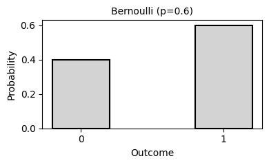</a></td>
		</tr>
		<tr>
			<td><strong>Binomial</strong></td>
			<td>n (trials), p (probability)</td>
			<td>Number of successes in n independent Bernoulli trials</td>
			<td><code>stats.binom.pmf(k, n, p)</code></td>
			<td><a href="../assets/distribution_plots/binomial.png" target="_blank">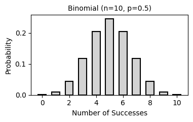</a></td>
		</tr>
		<tr>
			<td><strong>Poisson</strong></td>
			<td>λ (lambda, rate)</td>
			<td>Number of events in fixed time/space interval</td>
			<td><code>stats.poisson.pmf(k, mu)</code></td>
			<td><a href="../assets/distribution_plots/poisson.png" target="_blank">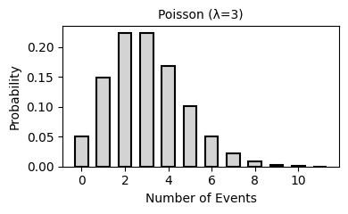</a></td>
		</tr>
		<tr>
			<td><strong>Geometric</strong></td>
			<td>p (probability of success)</td>
			<td>Number of trials until first success</td>
			<td><code>stats.geom.pmf(k, p)</code></td>
			<td><a href="../assets/distribution_plots/geometric.png" target="_blank">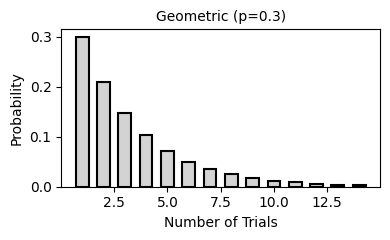</a></td>
		</tr>

		<tr>
			<td rowspan="9"><strong>Continuous</strong></td>
			<td><strong>Uniform</strong></td>
			<td>a (min), b (max)</td>
			<td>All values in interval [a, b] equally likely</td>
			<td><code>stats.uniform.pdf(x, a, b-a)</code></td>
			<td><a href="../assets/distribution_plots/uniform.png" target="_blank">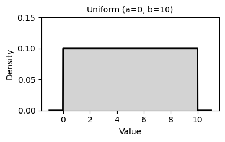</a></td>
		</tr>
		<tr>
			<td><strong>Normal (Gaussian)</strong></td>
			<td>μ (mean), σ (std dev)</td>
			<td>Symmetric bell curve; most common distribution</td>
			<td><code>stats.norm.pdf(x, mu, sigma)</code></td>
			<td><a href="../assets/distribution_plots/normal.png" target="_blank">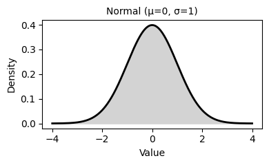</a></td>
		</tr>
		<tr>
			<td><strong>Exponential</strong></td>
			<td>λ (rate)</td>
			<td>Time between events in Poisson process</td>
			<td><code>stats.expon.pdf(x, scale=1/lambda)</code></td>
			<td><a href="../assets/distribution_plots/exponential.png" target="_blank">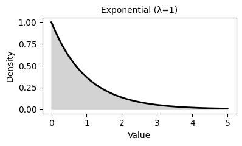</a></td>
		</tr>
		<tr>
			<td><strong>Gamma</strong></td>
			<td>k (shape), θ (scale)</td>
			<td>Generalizes exponential; sum of k exponential variables</td>
			<td><code>stats.gamma.pdf(x, k, scale=theta)</code></td>
			<td><a href="../assets/distribution_plots/gamma.png" target="_blank">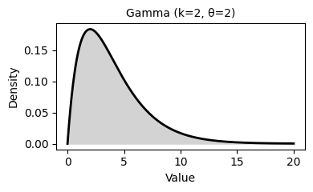</a></td>
		</tr>
		<tr>
			<td><strong>Beta</strong></td>
			<td>α (alpha), β (beta)</td>
			<td>Distribution on interval [0, 1]</td>
			<td><code>stats.beta.pdf(x, alpha, beta)</code></td>
			<td><a href="../assets/distribution_plots/beta.png" target="_blank">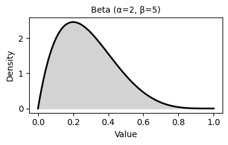</a></td>
		</tr>
		<tr>
			<td><strong>Chi-square (χ²)</strong></td>
			<td>df (degrees of freedom)</td>
			<td>Sum of squared standard normal variables</td>
			<td><code>stats.chi2.pdf(x, df)</code></td>
			<td><a href="../assets/distribution_plots/chi_square.png" target="_blank">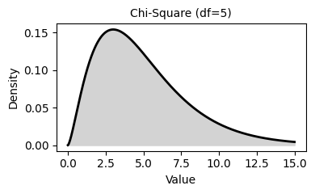</a></td>
		</tr>
		<tr>
			<td><strong>Student's t</strong></td>
			<td>df (degrees of freedom)</td>
			<td>Similar to normal but with heavier tails</td>
			<td><code>stats.t.pdf(x, df)</code></td>
			<td><a href="../assets/distribution_plots/t_distribution.png" target="_blank">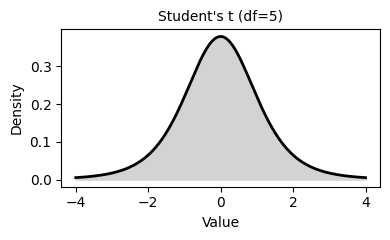</a></td>
		</tr>
		<tr>
			<td><strong>F-distribution</strong></td>
			<td>df1, df2 (degrees of freedom)</td>
			<td>Ratio of two chi-square distributions</td>
			<td><code>stats.f.pdf(x, df1, df2)</code></td>
			<td><a href="../assets/distribution_plots/f_distribution.png" target="_blank">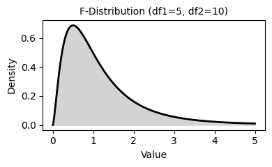</a></td>
		</tr>
		<tr>
			<td><strong>Pareto</strong></td>
			<td>α (shape), xₘ (scale/minimum)</td>
			<td>Power law distribution; models 80/20 rule phenomena</td>
			<td><code>stats.pareto.pdf(x, alpha, scale=xm)</code></td>
			<td><a href="../assets/distribution_plots/pareto.png" target="_blank">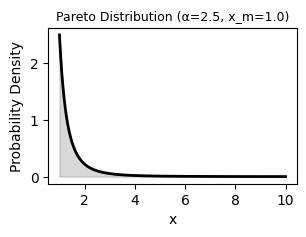</a></td>
		</tr>
	</tbody>
</table>

## 3. Statistical test selection guide

Before selecting a test, check the data type, distribution shape, and whether the samples are independent.

The tests listed below cannot be used with nominal data as the dependent variable. Choosing the correct statistical test and plotting data effectively depends on the data's statistical type. See the Wikipedia article [Statistical data type](https://en.wikipedia.org/wiki/Statistical_data_type) for more information.

The tests below come in two flavors that differ in assumptions. Parametric tests (t-test, F-test) make assumptions about the population's distribution and parameters, non-parametric tests (Mann-Whitney, Kruskal–Wallis) do not. Parametric vs non-parametric is a useful distinction when thinking about statistical tests and models. See [Parametric and Nonparametric: Demystifying the Terms](https://github.com/4GeeksAcademy/gperdrizet-ds9-materials/blob/main/resources/articles/Hoskin_parametric_and%20_nonparametric.pdf).

### 3.1. Most common/useful tests

#### 3.1.1. Student's t-test

- Use this test for comparing two groups.
- Wikipedia article: [Student's t-test](https://en.wikipedia.org/wiki/Student%27s_t-test)
- SciPy.stats implementation: [ttest_ind()](https://docs.scipy.org/doc/scipy/reference/generated/scipy.stats.ttest_ind.html)

**Notes:** Tests wether the difference between two groups is significant or not. Assumes that the data from which the samples were drawn is normally distributed and the samples have the same variance. If this is not true, see the Mann-Whitney U test, below.

#### 3.1.2. ANOVA (also known as the F-test)

- Use this test for comparing multiple groups.
- Wikipedia article: [F-test](https://en.wikipedia.org/wiki/F-test)
- SciPy.stats implementation: [f_oneway()](https://docs.scipy.org/doc/scipy/reference/generated/scipy.stats.f_oneway.html)

**Notes:** Tests whether or not one or more of the group means are different from the others. Assumes the data was drawn from a normally distributed population. If this is not true, see the Kruskal–Wallis test, below. Determining which sample(s) is/are different requires further analysis (see [Tukey's range test](https://en.wikipedia.org/wiki/Tukey%27s_range_test)).

#### 3.1.3. Mann-Whitney U test

- Use this test for comparing two groups that are not normally distributed.
- Wikipedia article: [Mann–Whitney U test](https://en.wikipedia.org/wiki/Mann%E2%80%93Whitney_U_test)
- SciPy.stats implementation: [mannwhitneyu()](https://docs.scipy.org/doc/scipy/reference/generated/scipy.stats.mannwhitneyu.html)

**Notes:** Uses the rank order of observations to test for difference between two groups. Data must be at least ordinal (larger or smaller has a clear meaning) and assumes that the shapes of the sample distributions are similar. If you decide not to use this test because the sample distributions look very different, you have your answer already. For completeness, maybe see the [Kolmogorov–Smirnov test](https://en.wikipedia.org/wiki/Kolmogorov%E2%80%93Smirnov_test) anyway.

#### 3.1.4. Kruskal-Wallis test (also known as ANOVA on ranks)

- Use this test for comparing two or more groups that are not normally distributed.
- Wikipedia article: [Kruskal–Wallis test](https://en.wikipedia.org/wiki/Kruskal%E2%80%93Wallis_test)
- SciPy.stats implementation: [kruskal()](https://docs.scipy.org/doc/scipy/reference/generated/scipy.stats.kruskal.html)

**Notes:** Uses rank order of observations to test whether or not one or more groups is different from the others. Follows the similar assumptions to the Mann-Whitney U test, above.

### 3.5. Assumption checklist

- Verify normality when using parametric tests.
- Check whether observations are independent.
- Confirm that groups have similar variance when required.
- Use non-parametric tests when sample size is small, data are ordinal, or assumptions are not met.

### 3.6. Complete test table

| Independent variable type | Dependent variable type | Situation | Parametric test | Non-parametric test | P-value interpretation |
|---------------------------|-------------------------|-----------|------------------|---------------------|------------------------|
| None | Continuous | Comparing one sample to a known value | One-sample t-test / Z-test | Wilcoxon signed-rank test | Low p-value: Sample mean significantly differs from known value |
| None | Continuous | Testing normality of data | Shapiro-Wilk test | Kolmogorov-Smirnov test | Low p-value: Data significantly deviates from normal distribution |
| None | Continuous | Comparing sample distribution to theoretical distribution | N/A | Kolmogorov-Smirnov test | Low p-value: Sample distribution differs from theoretical distribution |
| Categorical | Categorical | Comparing distributions of categorical variables | Chi-square test | Fisher's exact test (for small samples) | Low p-value: Observed distribution differs from expected |
| Categorical | Continuous | Comparing two independent groups | Independent samples t-test / Two-sample Z-test | Mann-Whitney U test (Wilcoxon rank-sum test) | Low p-value: Significant difference between the two groups |
| Categorical | Continuous | Comparing two paired/dependent groups | Paired t-test | Wilcoxon signed-rank test | Low p-value: Significant change between paired observations |
| Categorical | Continuous | Comparing three or more independent groups | One-way ANOVA | Kruskal-Wallis H test | Low p-value: At least one group differs from the others |
| Categorical | Continuous | Comparing three or more paired/dependent groups | Repeated measures ANOVA | Friedman test | Low p-value: Significant differences across repeated measurements |
| Categorical | Continuous | Testing effects of two or more factors | Two-way ANOVA / Factorial ANOVA | Scheirer-Ray-Hare test | Low p-value: Significant main effects or interaction effects |
| Categorical | Continuous | Comparing variances between two groups | F-test (Levene's test) | Levene's test / Fligner-Killeen test | Low p-value: Variances significantly differ between groups |
| Categorical | Categorical | Testing independence of two categorical variables | Chi-square test of independence | Fisher's exact test | Low p-value: Variables are dependent (not independent) |
| Continuous | Continuous | Testing relationship between two continuous variables | Pearson correlation | Spearman rank correlation / Kendall's tau | Low p-value: Significant correlation exists between variables |

### 3.7. Multiple testing correction

When you run many tests, the chance of false positives increases.

- Bonferroni is the simplest and most conservative correction.
- Holm-Bonferroni is less conservative than Bonferroni.
- Benjamini-Hochberg controls the false discovery rate.
- Post-hoc tests are appropriate after ANOVA when comparing specific group pairs.

## Source

- [Statistics overview](https://gperdrizet.github.io/FSA_devops/resource_pages/statistics.html)